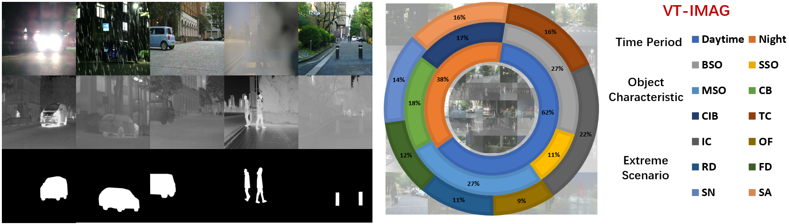

# (TPAMI 2024) Divide-and-Conquer: Confluent Triple-Flow Network for RGB-T Salient Object Detection 

    <a href='https://scholar.google.com/citations?hl=zh-CNJ' target='_blank'>Hao Tang1</a>&emsp;
    <a href='https://scholar.google.com/citations?user=L6J2V3sAAAAJ&hl=zh-CN' target='_blank'>Zechao Li1</a>&emsp; 
    <a href='https://scholar.google.com.hk/citations?hl=zh-CN&user=zxVy7sIAAAAJ' target='_blank'>Dong Zhang2</a>&emsp; 
    <a href='https://scholar.google.com/citations?user=rBWnK8wAAAAJ&hl=en' target='_blank'>Shengfeng He3</a>&emsp; 
    <a href='https://scholar.google.com/citations?user=ByBLlEwAAAAJ&hl=zh-CN' target='_blank'>Jinhui Tang1</a> 

 

    1Nanjing University of Science and Technology, Nanjing, China 
    2Hong Kong University of Science and Technology, Hong Kong, China 
    3Singapore Management University, Singapore&emsp; 
    

 -----------------

> Codes and Results are Coming Soon!

## Framework

> An overview of the proposed *ConTriNet*, which adopts an efficient *``Divide-and-Conquer''* strategy, is presented. ConTriNet comprises three main flows: a modality-complementary flow that predicts a modality-complementary saliency map, and two modality-specific flows that predict RGB- and Thermal-specific saliency maps, respectively. The union encoder of two modality-specific flows shares parameters and the overall framework can be trained end-to-end.

## VT-IMAG Dataset 

> The **primary purpose** of the constructed VT-IMAG is to drive the advancement of RGB-T SOD methods and facilitate their deployment in real-world scenarios. For a fair comparison, all models are solely trained on clear data and simple scenes (*i.e.*, training set of VT5000) and evaluated for **Zero-shot Robustness** on various real-world challenging cases in VT-IMAG. [Download Dataset (Google Drive)](https://drive.google.com/file/d/1xzvqoYLrmJ-6x33DygCP-LhFNYfhQL-u/view?usp=sharing)

> The prediction results of existing RGB-T SOD methods on VT-IMAG are now available for download, enabling researchers to easily compare their methods with existing SOTA methods and directly incorporate these results into their studies. [Download VT-IMAG Saliency_maps (Google Drive)](https://drive.google.com/drive/folders/18YWuQ4R-uYLElQEBN3WykQPasUtrxOuj?usp=sharing) 

## Benchmark Datasets

- [VT5000 (ArXiv)](https://arxiv.org/pdf/2007.03262.pdf) [Download Datasets (Google Drive)](https://drive.google.com/drive/folders/1So0dHK5-aKj1t6OmFhRGLh_0nsXbldZE?usp=sharing) 
- [VT1000 (ArXiv)](https://arxiv.org/pdf/1905.06741.pdf) [Download Datasets (Google Drive)](https://drive.google.com/drive/folders/1kEGOuljxKxIYwH54sNH_Wqmw7Sf7tTw5?usp=sharing) 
- [VT821 (ArXiv)](https://arxiv.org/pdf/1701.02829.pdf)  [Download Datasets (Google Drive)](https://drive.google.com/drive/folders/1gjTRVwvTNL0MJaJwS6vkpoi5rGyxIh41?usp=sharing)

## Saliency Maps

> The prediction results of existing RGB-T SOD methods and our ConTriNet on benchmark datasets are now available for download, enabling researchers to easily compare their methods with existing SOTA methods and directly incorporate these results into their studies.

- [Download VT5000 Saliency_maps (Google Drive)](https://drive.google.com/drive/folders/17sqNHH1NSyvDJgxW-1z65Ryn7p__zpV7?usp=sharing) 
- [Download VT1000 Saliency_maps (Google Drive)](https://drive.google.com/drive/folders/1ucKJxD6lzdJ1pKE3VR81ae9RHbdiXQBE?usp=sharing) 
- [Download VT821 Saliency_maps (Google Drive)](https://drive.google.com/drive/folders/1abbs3rcefsTSHFfBmPg8aFHxgCu78oIM?usp=sharing)  

## Evaluation

> We use this [Saliency-Evaluation-Toolbox](https://github.com/jiwei0921/Saliency-Evaluation-Toolbox) for evaluating all RGB-T SOD results.

## Citation

Please cite our paper if you find the work useful, thanks!

    @ARTICLE{10113165,
       author={Tang, Hao and Li, Zechao and Zhang, Dong and He, Shengfeng and Tang, Jinhui},
       journal={IEEE Transactions on Pattern Analysis and Machine Intelligence}, 
       title={Divide-and-Conquer: Confluent Triple-Flow Network for RGB-T Salient Object Detection}, 
       year={2024},
       doi={}
    }

